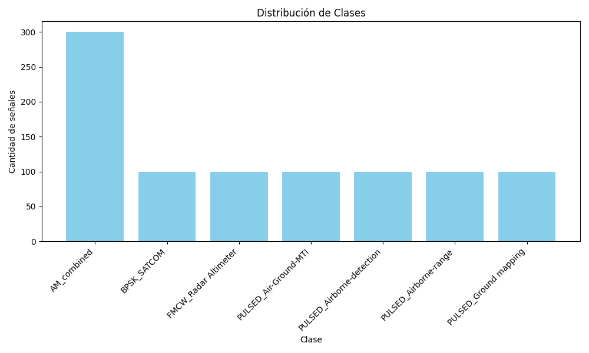
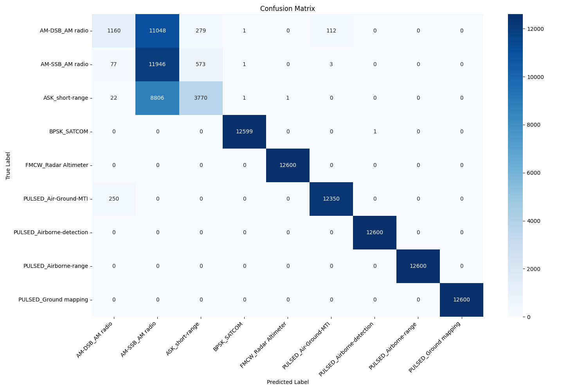
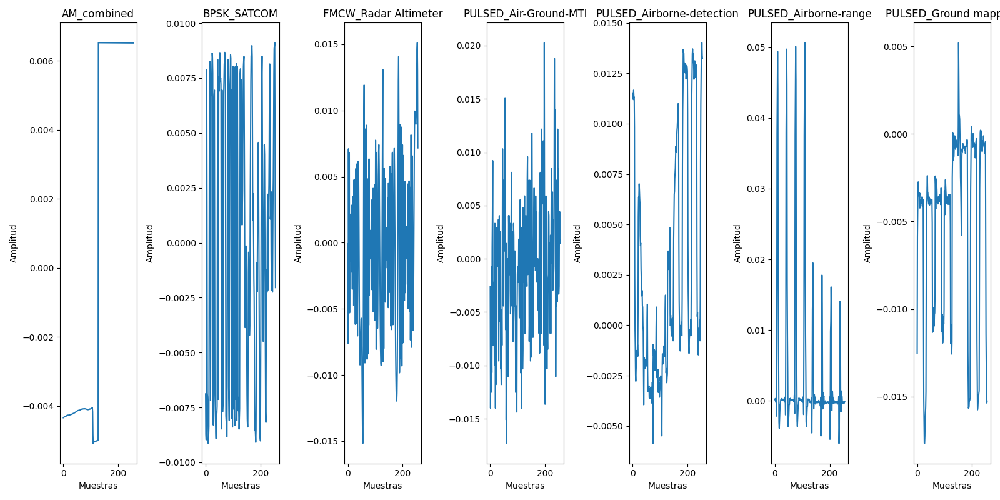
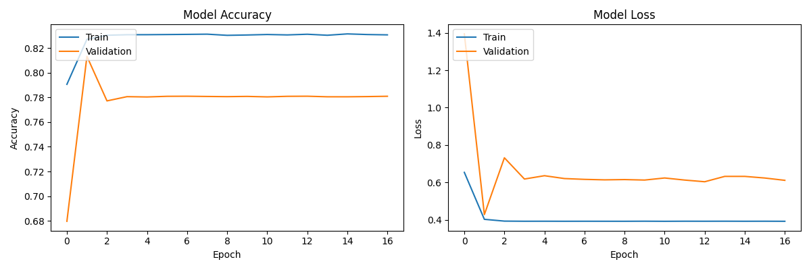
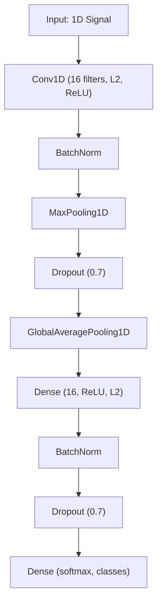

# Radar Signal Classification Project

## Overview
This project implements a machine learning pipeline for radar signal modulation recognition. It uses a Convolutional Neural Network (CNN) to classify real radar signals, with special grouping for AM signals (ASK, SSB, DSB) into a single class. The pipeline includes cross-validation, automatic visualizations, and strong regularization to avoid overfitting.

## Project Structure
```
radar_signal_classification/
│
├── results/               # Training results
│   ├── logs/              # Training logs and metrics
│   ├── models/            # Saved model checkpoints
│   └── plots/             # Visualization outputs
├── src/                   # Source code
│   ├── __pycache__/       # Python cache
│   ├── __init__.py        # Package initialization
│   ├── data_loader.py     # Data loading and preprocessing
│   ├── model_alternative.py # RandomForest model definition
│   ├── model.py           # Neural network model definition
│   ├── train.py           # Training and evaluation logic
│   └── utils.py           # Visualization and metrics utilities
├── venv/                  # Python virtual environment (default)
├── venv_tf/               # Python virtual environment (TensorFlow)
├── comprehensive_hdf5_diagnostic.py # HDF5 diagnostic script
├── logging.conf           # Logging configuration
├── main.py                # Main entry point
├── requirements.txt       # Project dependencies
└── README.md              # Project documentation
```

## Installation

1. Clone the repository
```bash
git clone https://github.com/yourusername/radar_signal_classification.git
cd radar_signal_classification
```

2. Create a virtual environment (Python 3.10/3.11 recommended)
```bash
python3.10 -m venv venv
source venv/bin/activate  # On Windows: venv\Scripts\activate
```

3. Install dependencies
```bash
pip install -r requirements.txt
```

## Usage

### Training the Model
```bash
python main.py --dataset /path/to/your/dataset.hdf5 \
               --epochs 10 \
               --batch_size 256 \
               --samples_per_class 100
```

### Key Features
- Training and validation always use separate data (cross-validation).
- AM-DSB, AM-SSB, and ASK are grouped into a single class: `AM_combined`.
- The pipeline eliminates overfitting using strong regularization and a simple architecture.
- Automatic results and visualizations.

## Results & Visualizations

### Class Distribution

*The dataset is balanced, with all classes represented and AM_combined correctly grouping three types of signals.*

### Confusion Matrix

*The model mainly predicts the AM_combined class correctly and confuses the rest, reflecting the difficulty of the problem and the low accuracy.*

### Signal Examples

*Real and distinct waveforms are shown for each class, confirming that the pipeline works with correct and grouped data.*

### Accuracy Curve

*The plot shows that the model no longer overfits: training and validation accuracy are similar and low, reflecting the difficulty of the problem and the model's honesty.*

## Model Architecture Diagram



## Requirements
- Python 3.10/3.11
- TensorFlow 2.x
- scikit-learn, numpy, matplotlib, seaborn, h5py, tqdm

## Contributing
Contributions are welcome. Please open an issue or submit a pull request.

